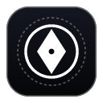

<div align="center">



# QOTA

**Universal Real-Time AI Quota Monitor & Tactile HUD**  
*A sleek, glassmorphic desktop Menu Bar (macOS) and System Tray (Windows) instrument for tracking remaining quotas across Google Antigravity, Claude Code, and OpenAI Codex.*

[](LICENSE)
[](https://jlsonon.github.io/qota)
[](https://github.com/jlsonon/qota)
[](test/)
[](#zero-cloud-telemetry--privacy)
[](#design-philosophy)

<br/>

[](https://vercel.com/new/clone?repository-url=https%3A%2F%2Fgithub.com%2Fjlsonon%2Fqota&project-name=qota&root-directory=website)

</div>

---

## Overview

**QOTA** is an ultra-lightweight, native desktop HUD and menu bar monitor purpose-built for engineers utilizing AI coding assistants. Instead of checking dashboards or guessing your remaining tokens, QOTA projects a razor-thin, tactile instrument anchored above all open windows—even across native macOS Full Screen spaces—giving you immediate visibility into your cycle allowances.

---

## Key Capabilities

### 1. Persistent Cocoa Level 1001 Floating HUD
* **`NSScreenSaverWindowLevel` (Level 1001)**: Standard floating utility windows use `NSFloatingWindowLevel` (Level 3), causing them to disappear behind native macOS Full Screen IDE spaces. QOTA binds directly to Level 1001, remaining visible over full-screen editors (VS Code, Cursor, Ghostty).
* **Ultra-Compact Footprint**: 285px &times; 40px micro-pill that can be dragged and docked anywhere across multi-monitor setups.
* **Decreasing Sprint Rail**: Live linear gauge with shimmer feedback indicating remaining units in the current 5-hour cycle.
* **Hover-to-Reveal Actions**: Expand button (`[↗]`) and optional 7-day weekly limit rail appear smoothly on cursor hover and fade out on departure.

### 2. Live Percentage Menu Bar & System Tray (`NSStatusItem` / Tray)
* **Direct Percentage Readout**: Displays the active remaining sprint percentage directly in your macOS menu bar (e.g. ` 88%`, ` 100%`).
* **Color-Coded Health Beacon**:
  * `Green`: &ge; 50% capacity remaining.
  * `Yellow / Amber`: 20% &ndash; 49% capacity (pre-throttle threshold).
  * `Red`: &lt; 20% capacity (throttle imminent).
* **Tray Context Menu**: Quick access to trigger manual refills, toggle between Floating HUD and Full Dashboard, or inspect detailed model breakdowns.

### 3. Multi-Assistant Weighted Accounting
QOTA tracks multi-model consumption using exact proportional multipliers based on token consumption cost:

| Assistant / Model | Multiplier | Sprint Units / Call | Status |
|---|:---:|:---:|:---:|
| **Google Antigravity** &bull; Gemini 3.8 Flash (High) | `1x` | -1 unit | Baseline |
| **OpenAI Codex** &bull; o3-mini (Reasoning) | `2x` | -2 units | Standard |
| **Anthropic Claude Code** &bull; Claude 3.7 Sonnet | `4x` | -4 units | High Density |
| **Anthropic Claude Code** &bull; Claude 3 Opus (Thinking) | `8x` | -8 units | Maximum Reasoning |

### 4. Zero-Cloud Telemetry & Privacy
* **100% Local File Ingestion**: Watches local session files (such as `~/.gemini/antigravity/history.jsonl` and session transcripts) to calculate deductions.
* **Zero Cloud Relays**: Never sends telemetry, credentials, or prompts to external servers.
* **No LLM Quota Overhead**: Ingestion runs purely via local file system hooks with 0 API calls or token usage.

### 5. Smart Health & Outage Detection
* **Context Window Nudge**: Proactively tracks context window fullness. When a session exceeds 70% capacity, QOTA displays a subtle status nudge (`Context at 74% — Run /compact or /clear to prevent token waste`).
* **Prompt Cache TTL Countdown**: Tracks Claude Code prompt cache hit rates with a live 5-minute countdown timer to cache expiry.
* **Public Service Outage Alerts**: Direct polling of public Statuspage endpoints (`status.claude.com`, `status.openai.com`) to alert you of upstream API degradations before your workflow stalls.

---

## Keyboard Controls & Shortcuts

The interactive web showcase and desktop client support zero-latency tactile keyboard bindings:

| Key | Action | Description |
|:---:|---|---|
| <kbd>1</kbd> | **Switch to Antigravity** | Sets active assistant to Gemini Flash (1x consumption) |
| <kbd>2</kbd> | **Switch to Claude Code** | Sets active assistant to Claude Sonnet / Opus (4x&ndash;8x consumption) |
| <kbd>3</kbd> | **Switch to OpenAI Codex** | Sets active assistant to o3-mini (2x consumption) |
| <kbd>SPACE</kbd> | **Simulate Prompt Dispatch** | Triggers prompt deduction with floating `-2u` telemetry toast |
| <kbd>R</kbd> | **Refill Sprint** | Restores 5-hour sprint pool to 250 units (100%) |
| <kbd>D</kbd> | **Toggle Dashboard** | Switches between Floating HUD bar and Expanded Matrix view |

---

## Quick Start

### Prerequisites
* **Node.js**: v18.0.0 or higher
* **npm**: v9.0.0 or higher

### 1. Installation & Local Execution
```bash
# Clone repository
git clone https://github.com/jlsonon/qota.git
cd qota

# Install dependencies
npm install

# Launch QOTA in Development Mode
npm start
```
Upon launch, QOTA docks directly into your macOS Menu Bar or Windows System Tray and spawns the floating HUD.

### 2. Running Test Suites
```bash
npm test
```
Executes all 13 unit tests verifying quota deduction maths, multipliers, live JSONL file watchers, and status alerts.

---

## Packaging Executables

QOTA utilizes `electron-builder` to assemble standalone, hardened production binaries.

### Build for macOS (.dmg and .app)
```bash
npm run build:mac
```
* Produces signed Universal binaries for **Apple Silicon (`arm64`)** and **Intel (`x64`)** inside `dist/`.
* Hardened runtime enabled with `NSScreenSaverWindowLevel` entitlements.
* *Note: If macOS Gatekeeper alerts on an unsigned local build, run:*
  ```bash
  xattr -cr /Applications/Qota.app
  ```

### Build for Windows (.exe and portable)
```bash
npm run build:win
```
* Generates an NSIS setup installer (`.exe`) and a standalone zero-install portable executable in `dist/`.

---

## Architecture & Codebase Map

```
qota/
├── assets/                  # High-DPI tray icons and color-coded status beacons
│   ├── icon.png             # Application glyph
│   ├── tray-green.png       # Menu bar icon: >= 50%
│   ├── tray-yellow.png      # Menu bar icon: 20% - 49%
│   └── tray-red.png         # Menu bar icon: < 20%
├── src/                     # Desktop HUD & Dashboard source
│   ├── index.html           # Floating HUD & expanded dashboard DOM
│   ├── styles.css           # Obsidian monochrome design system
│   ├── renderer.js          # HUD animation ticker & IPC bridge
│   └── quota-service.js     # Core accounting engine & transcript stream watcher
├── website/                 # Interactive web documentation & simulator
│   ├── index.html           # "Mac Studio" single-viewport hero showcase
│   ├── styles.css           # Web design system & frosted glassmorphism
│   └── script.js            # Web Audio haptics engine & desktop spaces simulator
├── test/                    # Automated test suites
│   ├── test-quota-service.js
│   └── test-live-watcher.js
├── main.js                  # Electron main process (Window level 1001, Tray lifecycle)
├── preload.js               # Context isolation security bridge
└── package.json             # Project metadata & build scripts
```

---

## Design Philosophy

* **Architectural Minimalism**: Eliminates flashy consumer gradients, oversized cards, and visual distractions.
* **Monochrome Precision**: Built purely with obsidian pitch blacks (`#08090b`), slate grays, and crisp laser-white monospace typography.
* **Zero Emojis**: Every indicator, status tag, and button uses custom SVGs, micro-glyphs, or high-density typography.

---

## License

Open source under the [MIT License](LICENSE). &copy; 2026 QOTA DEV.
